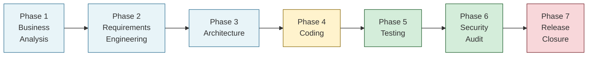

# The V-Model

Digital Innovation Agents is built around the V-Model -- a sequential
development process that bends in the middle. The left side is design
(what are we building?), the bottom is implementation (build it), and
the right side is verification (does it work? is it safe?). Each
left-side phase has a matching right-side phase that verifies it.

## Why the V-Model?

Traditional AI coding sessions look like this:

```
User idea -> Agent writes code -> PR
```

That skips everything that matters for real projects: understanding
the problem, defining the solution scope, making deliberate
architecture decisions, verifying the implementation. Small features
survive this shortcut. Anything bigger doesn't.

The V-Model forces a deliberate path:

1. Understand the problem **before** designing the solution
2. Define requirements **before** making architecture decisions
3. Design the architecture **before** implementing
4. Verify tests **before** running a security audit
5. Audit security **before** releasing

Every phase produces artifacts that the next phase reads. Nothing is
ad-hoc, nothing is in the agent's head, everything is in `_devprocess/`
so you can review, audit, and reproduce.

## The seven phases



**Phase 1 -- Business Analysis.** Exploration, Ideation, Validation.
Produces the `BA-{PROJECT}.md` document with personas, HMW question,
value proposition, idea potential, and critical hypotheses.

**Phase 2 -- Requirements Engineering.** Transforms the BA into Epics,
Features, and tech-agnostic Success Criteria. Produces the
`architect-handoff.md`.

**Phase 3 -- Architecture.** Creates ADRs (one per Critical ASR),
arc42 documentation, and the `plan-context.md` context bridge.

**Phase 4 -- Coding.** Critical review against the real codebase,
implementation with task-level guidelines, writeback to all artifacts.
This is the bottom of the V.

**Phase 5 -- Testing.** Integration tests, unit-test gap-filling,
fix-loop until all tests are green.

**Phase 6 -- Security Audit.** OWASP Top 10, OWASP LLM Top 10, SAST,
SCA, Zero Trust. Fix-loop until all critical findings are resolved or
explicitly deferred.

**Phase 7 -- Release Closure.** Final artifact synchronization,
release notes, CHANGELOG update, backlog cleanup, closing report.

## The traceability chain

Every artifact traces back to the one that produced it:

```
BA document (Why?)
  -> Epic (What, strategic?)
    -> Feature (What, concrete?)
      -> ASR (What is architecture-relevant?)
        -> ADR (How do we solve it?)
          -> plan-context.md (Context bridge)
            -> Critical Review (Does it fit the codebase?)
              -> Code
                -> Tests (Does it work?)
                  -> Security Audit (Is it safe?)
                    -> Release Closure (Close the cycle)
```

If you open a random line of code, you can walk backwards through this
chain and end up at a business motivation in the BA document. No
orphans, no "we added this because it seemed useful".

## Why the writeback matters

Every step in this chain also writes **backwards**. When `/coding`
finds that an ADR doesn't match the real codebase, it updates the ADR
before implementing. When a bug is fixed, the `FIX-NN` entry in
`20_bugs.md` gets a commit SHA. When a Feature's Success Criterion
can't be met as specified, the Feature file is updated with the
reason.

This is the [Living Documents pattern](./living-documents). It keeps
documentation in sync with reality.

## Phase transitions

Every phase ends with a mandatory 3-part [Handoff Ritual](./handoff-rituals)
and an explicit transition question. The [V-Model workflow orchestrator](../guides/v-model-workflow)
drives transitions when you run `/v-model-workflow`; individual phase
skills run the ritual too when invoked directly.

## Scope adaptation

The same V-Model runs for:

- **Simple Test / Feature** (hours to 1-2 days) -- minimal Exploration,
  skip Validation, focus on Definition of Done
- **Proof of Concept** (1-4 weeks) -- shortened Exploration, full
  Ideation, hypothesis-driven Validation
- **Minimum Viable Product** (2-6 months) -- full Exploration, full
  Ideation, complete market Validation

The phases are the same. The depth adapts.

## See also

- [V-Model workflow guide](../guides/v-model-workflow) -- the orchestrator
- [A full V-Model run tutorial](../tutorials/full-v-model-run) -- end-to-end walkthrough
- [Living Documents](./living-documents) -- the writeback pattern
- [Handoff Rituals](./handoff-rituals) -- phase transitions
