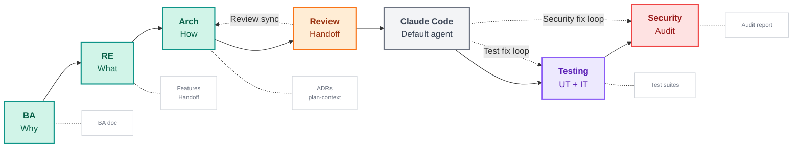

# Digital Innovation Agents

A V-Model workflow for AI coding assistants. You bring a rough idea,
the agent walks you through exploration, requirements, architecture,
implementation, testing, and security, one deliberate step at a time.
Every phase produces artifacts the next phase can read. At the end you
have code plus documentation that matches what you actually built.

  <a href="/digital-innovation-agents/tutorials/installation" class="vp-button" style="display: inline-block; padding: 0.6rem 1.2rem; background: var(--vp-c-brand-1); color: #fff; border-radius: 6px; text-decoration: none; font-weight: 500; margin-right: 0.5rem;">Getting Started</a>
  <a href="/digital-innovation-agents/tutorials/full-v-model-run" class="vp-button" style="display: inline-block; padding: 0.6rem 1.2rem; border: 1px solid var(--vp-c-divider); color: var(--vp-c-text-1); border-radius: 6px; text-decoration: none; font-weight: 500;">Walk through the full cycle</a>

## The workflow in one picture

Structured AI skills from analysis to security audit, with fix loops
and living documents. Each phase produces artifacts that feed the next.

## How it works

- **BA and RE** are your first two phases. You explore the problem
  with personas, needs, and how-might-we questions, then turn them
  into Epics and Features with tech-agnostic Success Criteria.
- **Architecture** proposes ADRs and a plan-context. The agent writes
  one decision record per architecturally significant requirement.
- **Review handoff** reconciles the design against your real codebase
  before implementation begins. This is where ADRs get adjusted if
  they do not match reality.
- **Claude Code (or your coding assistant of choice)** runs the
  implementation, guided by task-breakdown rules and a verification
  gate that blocks premature "done" claims.
- **Testing and Security** come with their own fix loops. They keep
  iterating until all tests pass and critical findings are resolved.
- **Living documents** flow back up the V. ADRs, Features, and the
  plan-context update themselves during implementation so
  documentation always reflects the actual code.

You can run the full cycle via `/v-model-workflow`, or start at any
phase with a single skill like `/business-analyse`. The workflow is
advisory: say "stop" or "ignore the V-Model today" and the agent
steps back into plain mode.

## Next steps

- **[Getting Started](./tutorials/installation)**: install on Claude Code, Cursor, Codex, OpenCode, Gemini CLI, or GitHub Copilot
- **[A full V-Model run](./tutorials/full-v-model-run)**: all 7 phases end to end with a small example project
- **[Your first Business Analysis](./tutorials/first-business-analysis)**: walk through Phase 1 on your own idea
